# Aetherix – F&B Ambient Agent  
**PMS-agnostic intelligence layer to anticipate staffing & F&B needs in hotels**

> (AI) Insights come to and learn from you (WhatsApp, Slack, Teams) instead of yet another dashboard to onboard.  
> Contextual predictions + feedback loop + explainability, no vendor lock-in.

[](https://www.python.org)
[](https://fastapi.tiangolo.com)
[](https://aetherix.streamlit.app/)
[](https://opensource.org/licenses/MIT)
[](https://huggingface.co/spaces/ivandemurard/fb-agent-api)

**Live Dashboard (Phase 3, early prototype)** → https://aetherix.streamlit.app/

### Real Problem (Hospitality 2026)
Restaurant managers spend **5–8 hours/week** on manual forecasting with ~**70%** accuracy → over/under-staffing, food waste, operational stress.

### Solution: A new (AI) Colleague
or agent, that:
- **Anticipates** demand (covers, staffing, purchases) using RAG + external signals (weather, events, holidays, and real-time social sentiment)
- **Explains** its predictions (impact %, confidence score) for transparency and adoption
- **Learns** from your corrections and PMS data (feedback loop) for continuous and autonomous improvement
- **Delivers where you work**: WhatsApp/Slack for quick briefs, dashboard for adoption, config & deep dive
- **PMS-agnostic**: using a semantic layer connecting Mews, Opera, Apaleo, Cloudbeds, etc. without lock-in. Smart!

| Classic Dashboard            | Ambient Agent (Aetherix)              |
|------------------------------|----------------------------------------|
| You have to remember to check| Agent proactively sends you the brief |
| Painful context switching    | Integrated into your daily tools       |
| Feedback = separate step     | Natural correction in conversation     |
| PMS + external data silos    | Semantic unification + contextual RAG  |

### Architecture (3 Layers)

Voir les diagrammes SVG ci-dessous dans la section Architecture.

---

## 💡 The solution I'm working on:

An **intelligence layer** for hotel managers that:
- **Connects to any PMS** through a semantic abstraction layer (Mews, Opera, Apaleo, Protel, Cloudbeds, ...)
- **Predicts demand** using RAG architecture with internal and external historical pattern matching
- **Explains reasoning** so managers can trust and correct predictions (transparency)
- **Learns from feedback** to improve accuracy over time (feedback loop)
- **Lives where you work** : via a dashboard for analytics, and messaging apps for daily operations

---

## 🏗️ Architecture

### Flow View



### Value View


---

## ✨ Key Features

**🧠 Contextual Predictions**
- Combines external signals (city events, weather, holidays, real-time social sentiment) with internal data (occupancy, past demand)
- Qdrant vector search finds similar historical patterns
- Claude AI generates explainable reasoning

**🔍 Transparent Reasoning**
- Every prediction shows WHY with a clear breakdown of impact percentages
- Confidence scoring based on pattern match quality

**🔄 Learning Feedback Loop**
- Pre-service validation: "Does 26 covers look right to you?"
- Post-service feedback: Actual covers input
- Visible accuracy improvement: "Your feedback improved accuracy: 68% → 74%"

**🔗 PMS-Agnostic Integration**
- Semantic layer abstracts any PMS API
- No vendor lock-in, it will work with Mews, Opera, Protel, Cloudbeds
- Adding new PMS = new adapter, not agent rewrite

**📱 Ambient Experience**
- Dashboard-first design (Aetherix UI live)
- Dashboard for transparency, settings, analytics, and complex planning
- Voice/chat in messaging apps (WhatsApp, Slack, Teams) planned for Phase 5

---

## 🛠️ Tech Stack

| Layer | Technology | Purpose |
|-------|-----------|---------|
| **Backend** | FastAPI + Python 3.11 | REST API, multi-agent orchestration |
| **AI/ML** | Claude Sonnet 4 (Anthropic) | Reasoning engine, natural language explanations |
| **Embeddings** | Mistral Embed | Vector embeddings for semantic search (1024 dim) |
| **Vector DB** | Qdrant Cloud | Semantic pattern search (495 patterns) |
| **Database** | Supabase (PostgreSQL) | Restaurant profiles, predictions, feedback, accuracy |
| **Cache** | Redis (Upstash) | Session state, conversation context |
| **Frontend** | Streamlit (MVP) / Next.js (v2) | Dashboard interface |
| **Deployment** | HuggingFace Spaces (Docker) | Cloud hosting, auto-scaling |

---

## 🚀 Live Demo

**Primary dashboard:** [https://aetherix.streamlit.app](https://aetherix.streamlit.app) (Streamlit Cloud)  
**Also:** [https://ivandemurard-fb-agent-api.hf.space](https://ivandemurard-fb-agent-api.hf.space) (HuggingFace Space: dashboard + API; API docs at `/docs`)

### Deployment

| Component | Status | URL |
|-----------|--------|-----|
| **Dashboard (primary)** | ✅ Live | [aetherix.streamlit.app](https://aetherix.streamlit.app) |
| HF Space (dashboard + API) | ✅ Live | [ivandemurard-fb-agent-api.hf.space](https://ivandemurard-fb-agent-api.hf.space) |
| Vector DB | ✅ Live | Qdrant Cloud (495 patterns) |

**Sync:** One push to `main` updates both: a GitHub Action syncs `main` → `master`, so Streamlit Cloud (on `master`) and the HF Space (on `main`) deploy the same code.

**Docker:** The default `Dockerfile` runs API (port 8000) + Streamlit dashboard (port 7860) for the HF Space. For API-only deployment use `Dockerfile.api`.

---

## 📈 Roadmap

### ✅ Phase 1 - Backend API (Complete)

Delivered:
- Multi-agent system (Demand Predictor, Staff Recommender, Reasoning Engine)
- Context-aware prediction with mock patterns
- Confidence scoring + explainable reasoning
- HuggingFace Spaces deployment

### ✅ Phase 2 - RAG Implementation (Complete)

Delivered:
- Kaggle Hotel Booking dataset processed (119K reservations → 495 F&B patterns)
- Qdrant vector database with Mistral embeddings
- Semantic similarity search powering predictions
- Live API with real vector search

### 🔄 Phase 3 - Dashboard & Feedback Loop (Current)

In progress:
- **Restaurant Profile**: Capacity, breakeven, staff ratios configuration
- **Post-service Feedback**: Actual covers input to close the loop
- **Accuracy Tracking**: Real MAPE calculation, visible learning progress
- **UI Anti-Slop**: Factor visibility, human context, contextual recommendations
- **Data Sources UI**: Transparent architecture roadmap in Settings

Linear issues: IVA-52, IVA-53, IVA-54, IVA-55, IVA-56

### 📋 Phase 4 - Feedback Loop + Accuracy (Next)

Planned:
- **Post-service Feedback**: Actual covers input to close the loop
- **MAPE Tracking**: Real accuracy calculation and display
- **Prediction History**: Accuracy history view
- **Continuous Learning**: Pipeline from feedback to model improvement

### 🔮 Phase 5 - Integrations (Future)

Vision:
- **PMS Connectors**: Mews, Opera, Protel adapters
- **POS Auto-sync**: Real cover data from Toast, Square, etc.
- **Voice/Chat Interface**: WhatsApp, Slack, Teams (ambient AX)
- **What-if Scenario Modeling**

---

## ⚙️ Configuration

```bash
# Required
ANTHROPIC_API_KEY=sk-ant-...          # Claude AI
QDRANT_API_KEY=...                    # Vector database
QDRANT_URL=https://...                # Qdrant cluster URL
MISTRAL_API_KEY=...                   # Embeddings generation

# Database
SUPABASE_URL=...                      # PostgreSQL
SUPABASE_KEY=...                      # Database auth

# Optional (for enhanced features)
REDIS_URL=...                         # Session cache
PREDICTHQ_API_KEY=...                 # Events data
OPENWEATHER_API_KEY=...               # Weather data
ELEVENLABS_API_KEY=...                # Voice interface
```

### Tech Stack

- **Backend**: FastAPI · Python 3.11
- **AI**: Claude Sonnet 4 (Anthropic) · Mistral Embeddings
- **Vector DB**: Qdrant Cloud (495 patterns indexed)
- **Storage**: Supabase (PostgreSQL) · Redis (cache & sessions)
- **Frontend MVP**: Streamlit · (Next.js planned for v2)
- **Deploy**: Hugging Face Spaces (Docker)

## **Looking for**  
- **Feedback on project** DM me on X @ivandemurard or [Book a call](https://cal.com/ivandemurard/30min)
- Beta hotels or restaurants (currently using mock data to start)
- Tips
- A product / AI role in hospitality tech SaaS

**Say Hi!**

Built with ❤️ by Ivan de Murard for hotels, restaurants, and those who love them
[Portfolio](https://ivandemurard.com) · [X](https://x.com/ivandemurard) · [LinkedIn](https://linkedin.com/in/ivandemurard) · ivandemurard@gmail.com

MIT License

