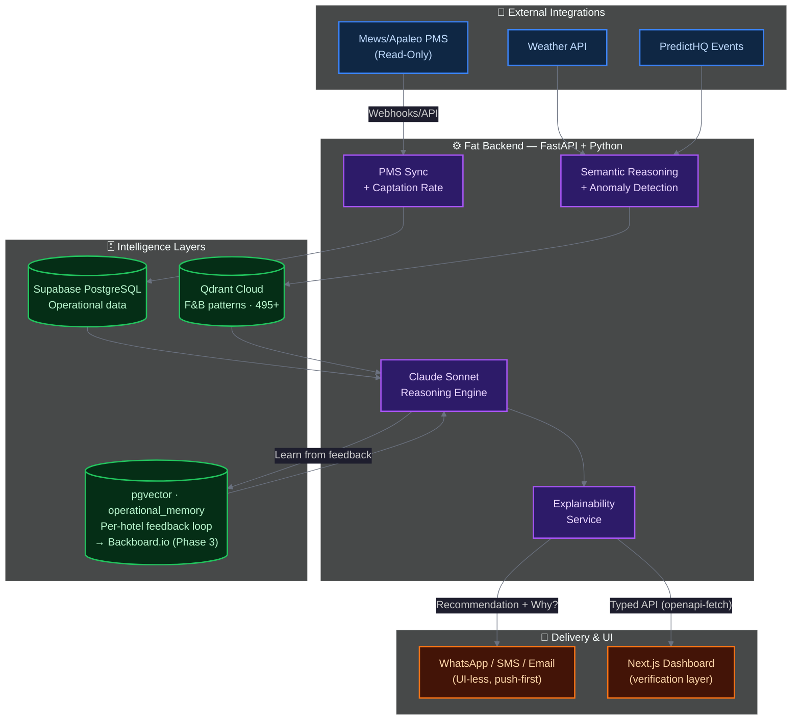

<h1 align="center">Aetherix</h1>
<p align="center">
  <em>The Operational Decision Engine for Hotel F&B Managers.</em>
</p>
<p align="center">
  <em>We don't help you build schedules. We tell you what tomorrow will look like, and what to do about it.</em>
</p>

<p align="center">
  
  
  
  
  
  
  
  
</p>

## Overview

Aetherix is an Agentic AI solution designed to solve the manual, anxiety-inducing process of Staff and Food & Beverage forecasting for hotel and restaurant managers.

By transitioning from traditional, static "pull" dashboards to a proactive UI-less "push" model, Aetherix anticipates operational load.
It synthesizes internal property data (occupancy, bookings, PMS, POS, ...) with an external semantic layer — incorporating local events, weather, and real-time signals.

**Key insight:** Occupancy rate ≠ restaurant demand. A hotel at 87% occupancy in Paris may have a dinner capture rate of 10%, while the same occupancy at a mountain resort yields 85%. Aetherix models each property's historical capture rate and applies contextual demand modifiers — not theoretical ratios — to produce recommendations that match operational reality.

The result: Contextualized intelligence delivered directly to departmental managers when they need it — reducing food waste (hotels waste ~25% of food produced), cutting unnecessary labor costs, and enabling managers to focus on delivering exceptional guest experiences.

### The Problem vs. The Aetherix Solution

| Feature | The Problem (Traditional "Pull") | The Solution (Aetherix "Push") |
| :--- | :--- | :--- |
| **Data Interaction** | Requires manual login & dashboard checks | Proactive alerts via SMS, WhatsApp, or Email |
| **Forecasting** | Guesswork based on static historical reports | Contextualized ML/LLM predictions calibrated per property |
| **Actionability** | Leaves manager to decipher the "So What?" | Delivers clear, high-ROI operational directives with risk level |
| **Context** | Siloed PMS data | Synthesized internal + external (weather, events) data |
| **Demand modeling** | Occupancy rate used as proxy for covers | Property-specific capture rate × contextual modifiers |
| **Food waste** | ~25% of F&B produced is wasted (ADEME/Accor, FR) | Better demand prediction → reduced over-preparation |

---

## Key Features & Innovation

*   **Semantic Reasoning Engine:** Mathematical translation of chaotic external data (weather, events, real-time social sentiment) into specific, high-ROI operational directives (revenue opportunity vs. labor cost). Output example: *"Dinner covers +22% tonight - concert nearby + high occupancy. Recommendation: add 1 server, prep +18% portions. Risk: High if unchanged."*
*   **Conversational Receipts (Zero-Dashboard Trust):** If a manager questions a recommendation (e.g., replies "Why?"), Aetherix responds instantly with a clear and immediately scannable breakdown with historical context. Trust is built by clearly explaining contextualised business decisions in an adapted language.
*   **Property-Calibrated Demand Modeling:** Aetherix learns each property's real capture rate (% of in-house guests who dine on-site), not a theoretical industry ratio. A property in Paris with 10% capture behaves fundamentally differently from a mountain resort at 80%. The model adapts.
*   **Painless Pilot & 1-Way Sync:** Designed for zero-friction integration. Aetherix requires only a read-only webhook/API key from legacy or modern PMS systems (Mews, Apaleo, etc.) to begin establishing baselines.

---

## How Aetherix Differs from WFM Tools

Existing workforce management tools (Quinyx, Legion, Actabl/Hotel Effectiveness, Unifocus, Deputy) operate on a **scheduling-first** paradigm: they help you build and manage staff schedules, with basic forecasting as an add-on..

Aetherix operates on a **forecast-first** paradigm. The schedule is the manager's job. Aetherix answers the question that comes before:

> **"How busy will (...) actually be, and what should be adjusted?"**

| Dimension | WFM Tools (Quinyx, Legion, Actabl…) | Aetherix |
| :--- | :--- | :--- |
| **Paradigm** | Scheduling-first, forecast as add-on | Forecast-first, decision directive as output |
| **Interface** | Dashboard / mobile app (pull) | WhatsApp / Slack / Email (push, UI-less) |
| **Demand modeling** | Historical sales patterns | PMS + capture rate + weather + events |
| **Output** | "Here is your schedule" | "Here is what to adjust, and why" |
| **Explainability** | Limited (score or aggregate view) | Conversational ("Why?", "What if -10% occupancy?") |
| **Integration model** | Full WFM platform replacement | Additive layer on top of existing tools |
| **Target buyer** | HR / Operations Director | F&B Manager / Restaurant Manager (daily user) |

---

## Built with the BMAD Methodology

Aetherix was conceived, structured, and validated using the rigorous **BMAD (Business, Market, Architecture, Design)** methodology. This ensures the project is not just a technical proof-of-concept, but a viable SaaS product.

*   **Business Justification:** Clear financial ROI and metrics for success (e.g., Target MAPE < 15%, Labor Cost reduction).
*   **Domain Compliance:** Explicit architectural decisions to handle GDPR (anonymized PII) and European Labor Laws (calculating penalty pay into recommendations).
*   **Traceable Architecture:** Documented logic separating business requirements from technical implementation layers.

---

## Architecture & Technical Strategy

The architecture adheres to a strict "Thin Frontend / Fat Backend" philosophy. The intelligence stack has four distinct layers working in sequence to produce a single actionable recommendation.


```mermaid
%%{init: {'theme': 'dark', 'themeVariables': {'edgeLabelBackground': '#1e1e2e', 'lineColor': '#6b7280'}}}%%
graph TD
    subgraph EXT["📡 External Integrations"]
        PMS["Mews/Apaleo PMS\n(Read-Only)"]
        Weather["Weather API"]
        Events["PredictHQ Events"]
    end

    subgraph BACK["⚙️ Fat Backend — FastAPI + Python"]
        Sync["PMS Sync\n+ Captation Rate"]
        Semantic["Semantic Reasoning\n+ Anomaly Detection"]
        RAG["Claude Sonnet\nReasoning Engine"]
        Explain["Explainability\nService"]
    end

    subgraph DATA["🗄️ Intelligence Layers"]
        DB[("Supabase PostgreSQL\nOperational data")]
        Vector[("Qdrant Cloud\nF&B patterns · 495+")]
        Memory[("pgvector · operational_memory\nPer-hotel feedback loop\n→ Backboard.io (Phase 3)")]
    end

    subgraph DELIVERY["🚀 Delivery & UI"]
        Push["WhatsApp / SMS / Email\n(UI-less, push-first)"]
        Frontend["Next.js Dashboard\n(verification layer)"]
    end

    PMS -- "Webhooks/API" --> Sync
    Weather --> Semantic
    Events --> Semantic
    Sync --> DB
    Semantic --> Vector
    DB --> RAG
    Vector --> RAG
    Memory --> RAG
    RAG --> Explain
    Explain -- "Recommendation + Why?" --> Push
    Explain -- "Typed API (openapi-fetch)" --> Frontend
    RAG -- "Learn from feedback" --> Memory

    classDef external  fill:#0f2744,stroke:#3b82f6,stroke-width:2px,color:#bfdbfe
    classDef backend   fill:#2d1b69,stroke:#a855f7,stroke-width:2px,color:#e9d5ff
    classDef db        fill:#052e16,stroke:#22c55e,stroke-width:2px,color:#bbf7d0
    classDef delivery  fill:#431407,stroke:#f97316,stroke-width:2px,color:#fed7aa

    class PMS,Weather,Events external
    class Sync,Semantic,RAG,Explain backend
    class DB,Vector,Memory db
    class Push,Frontend delivery
```

### The Four Intelligence Layers

| Layer | Technology | Role |
| :--- | :--- | :--- |
| **1. Numerical Forecast** | Prophet (time-series) | Predicts covers volume from PMS + occupancy + regressors |
| **2. Semantic Patterns** | Qdrant Cloud (495+ vectors) | Matches current context against similar historical service scenarios |
| **3. Cognitive Memory** | pgvector → Backboard.io (Ph. 3) | Two-layer design. **Private Memory** (per hotel, Phase 0–1): ultra-specific idiosyncrasies - what works *only* for this property (real capture rate, manager preferences, non-generalizable local patterns). **Hive Memory** (anonymized cross-hotel, Phase 3 via Backboard): patterns grouped by tags (city/resort/airport, clientele type, segment, restaurant size) — enriches predictions with cross-property proof of impact. Each hotel benefits from its own learning *and* collective wisdom, never sharing raw data. |
| **4. Reasoning & Explanation** | Claude Sonnet (Anthropic) | Synthesizes the three layers into a directive with natural-language explanation |

### Tech Stack Breakdown

| Layer | Technologies | Purpose |
| :--- | :--- | :--- |
| **Frontend (UI)** | Next.js (App Router), Tailwind CSS, shadcn/ui | Verification and oversight layer — not the primary interaction surface |
| **Backend (AI/Logic)** | Python, FastAPI, APScheduler | LLM orchestration, async jobs, push dispatch |
| **Operational DB** | Supabase (PostgreSQL) + RLS | Multi-tenant data isolation, actuals tracking |
| **Pattern Store** | Qdrant Cloud | Vector similarity search for F&B scenario patterns |
| **Cognitive Memory** | pgvector `operational_memory` → Backboard.io (Ph. 3) | Phase 0–1: per-hotel feedback loop via `MemoryProvider` interface. Phase 3: Backboard adds structured insights + anonymized cross-hotel pattern generalization (by segment, location, clientele type). |
| **Delivery** | Twilio (WhatsApp/SMS), SendGrid | UI-less push notifications; inbound "Why?" reply handling |
| **Client-Server Contract** | OpenAPI, `openapi-fetch` | End-to-end type safety |

---

## Project Structure

```text
aetherix/
├── backend/                 # FastAPI — AI orchestration & business logic
│   └── app/
│       ├── api/             # HTTP routes (auth, pms, predictions, reports)
│       ├── db/              # PostgreSQL models & session
│       ├── services/        # Reasoning engine, RAG, PMS sync, WhatsApp…
│       └── integrations/    # External tools: Obsidian (knowledge base), Linear (issues)
├── frontend/                # Next.js App Router UI
│   └── src/
│       ├── app/             # Pages: dashboard, settings, auth
│       ├── components/      # shadcn/ui + feature components
│       └── lib/             # openapi-fetch generated API client
├── docs/                    # Architecture, roadmap, BMAD methodology
├── scripts/                 # Dev & ops utility scripts
├── supabase/                # DB migrations
├── local-shared-data/       # OpenAPI spec shared between backend & frontend
├── docker-compose.yml       # Local dev: backend + frontend + postgres + mailhog
└── archive/                 # Legacy code (pre-FastAPI era) — not used in production
```

---
Made with ❤️ for hotels, restaurants, and those who love them. Ivan de Murard
---
*Aetherix - Contextual Intelligence for Hospitality Operations.* 
