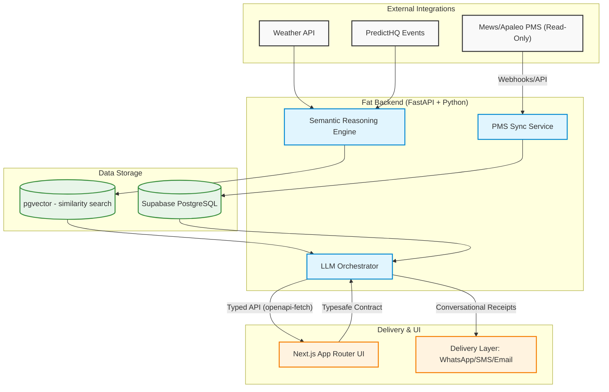

<p align="center">
  
</p>
<h1 align="center">Aetherix</h1>
<p align="center">
  <em>Proactive, Agentic AI for Hospitality F&B Forecasting.</em>
</p>

## Overview

Aetherix is an Agentic AI solution designed to solve the manual, anxiety-inducing process of Food & Beverage forecasting for hotel and restaurant managers. 

By transitioning from traditional, static "pull" dashboards to a proactive "push" model, Aetherix anticipates operational load. It synthesizes internal property data (occupancy, bookings) with an external semantic layer—incorporating local events, weather, and real-time social sentiment. 

The result? Contextualized intelligence delivered directly to departmental managers when they need it, empowering them to focus on exceptional customer experiences while reducing food waste and optimizing labor costs.

### The Problem vs. The Aetherix Solution

| Feature | The Problem (Traditional "Pull") | The Solution (Aetherix "Push") |
| :--- | :--- | :--- |
| **Data Interaction** | Requires manual login & dashboard checks | Proactive alerts via SMS, WhatsApp, or Email |
| **Forecasting** | Guesswork based on static historical reports | Contextualized ML/LLM predictions |
| **Actionability** | Leaves manager to decipher the "So What?" | Delivers clear, high-ROI operational directives |
| **Context** | Siloed PMS data | Synthesized internal + external (weather, events) data |

#### 💡 "The Surge Save" (Core Use Case)
1. **The Context:** It's Tuesday morning. The hotel is at a quiet 45% occupancy. No extra staff scheduled for the evening.
2. **The Intelligence:** Aetherix detects a tech conference relocated next door. Historical data shows similar local events cause a 25% bump in external walk-ins.
3. **The Push:** Aetherix alerts the F&B Manager via WhatsApp: *"Anticipating an extra £1,200 in F&B revenue tonight (6 PM - 9 PM) due to nearby conference. Recommend calling 2 servers and 1 prep cook (est. labor cost: £180). Target: 14 total staff."*
4. **The Action:** The manager secures the staff, captures the external revenue, and avoids a dinner service meltdown.

---

## Key Features & Innovation

*   **Semantic Reasoning Engine:** Mathematical translation of chaotic external data (weather, events, traffic) into specific, high-ROI operational directives (revenue opportunity vs. labor cost).
*   **Conversational Receipts (Zero-Dashboard Trust):** If a manager questions a recommendation (e.g., replies "Why?"), Aetherix instantly responds with the mathematical breakdown and historical context. Trust is built via immediate, conversational Q&A, not complex dashboards.
*   **Painless Pilot & 1-Way Sync:** Designed for zero-friction integration. Aetherix requires only a read-only webhook/API key from legacy or modern PMS systems (Mews, Apaleo) to begin establishing baselines.

---

## Built with the BMAD Methodology

Aetherix was conceived, structured, and validated using the rigorous **BMAD (Business, Market, Architecture, Design)** methodology. This ensures the project is not just a technical proof-of-concept, but a viable SaaS product.

*   **Business Justification:** Clear financial ROI and metrics for success (e.g., Target MAPE < 15%, Labor Cost reduction).
*   **Domain Compliance:** Explicit architectural decisions to handle GDPR (anonymized PII) and European Labor Laws (calculating penalty pay into recommendations).
*   **Traceable Architecture:** Documented logic separating business requirements from technical implementation layers.

---

## Architecture & Technical Strategy

The architecture adheres to a strict "Thin Frontend / Fat Backend" philosophy, optimizing for robust LLM orchestration and strict data segregation.


```mermaid
graph TD
    %% External Data Sources
    subgraph "External Integrations"
        PMS["Mews/Apaleo PMS (Read-Only)"]
        Weather[Weather API]
        Events[PredictHQ Events]
    end

    %% Backend Layer
    subgraph "Fat Backend (FastAPI + Python)"
        Sync[PMS Sync Service]
        Semantic[Semantic Reasoning Engine]
        RAG[LLM Orchestrator]
    end

    %% Database Layer
    subgraph "Data Storage"
        DB[(Supabase PostgreSQL)]
        Vector[(pgvector - similarity search)]
    end

    %% Delivery / Frontend
    subgraph "Delivery & UI"
        Frontend[Next.js App Router UI]
        Push[Delivery Layer: WhatsApp/SMS/Email]
    end

    %% Relationships
    PMS -- Webhooks/API --> Sync
    Weather --> Semantic
    Events --> Semantic

    Sync --> DB
    Semantic --> Vector
    Vector --> RAG
    DB --> RAG

    RAG -- Conversational Receipts --> Push
    RAG -- Typed API (openapi-fetch) --> Frontend
    Frontend -- Typesafe Contract --> RAG

    classDef external fill:#f9f9f9,stroke:#333,stroke-width:2px;
    classDef backend fill:#e1f5fe,stroke:#0288d1,stroke-width:2px;
    classDef db fill:#e8f5e9,stroke:#388e3c,stroke-width:2px;
    classDef delivery fill:#fff3e0,stroke:#f57c00,stroke-width:2px;

    class PMS,Weather,Events external;
    class Sync,Semantic,RAG backend;
    class DB,Vector db;
    class Frontend,Push delivery;
```

### Tech Stack Breakdown

| Layer | Technologies | Purpose |
| :--- | :--- | :--- |
| **Frontend (UI)** | Next.js (App Router), Tailwind CSS, shadcn/ui | "Thin Frontend" presentation and dashboarding. |
| **Backend (AI/Logic)** | Python, FastAPI | "Fat Backend" for LLM chains and async webhook processing. |
| **Data & Reasoning** | Supabase (PostgreSQL), `pgvector` | RAG, similarity search, and tenant isolation (RLS). |
| **Delivery** | Twilio, SendGrid/Postmark | Orchestrating multi-channel push notifications. |
| **Client-Server Contract** | OpenAPI, `openapi-fetch` | End-to-end type safety preventing integration bugs. |

---

## Project Structure

The repository is structured as a monorepo separating the frontend and backend concerns cleanly:

```text
aetherix-mvp/
├── nextjs-frontend/         # The React/Next.js UI Application
│   ├── src/app/             # App Router pages (Dashboard, Settings)
│   ├── src/components/      # UI components (shadcn/ui)
│   └── src/lib/             # openapi-fetch generated client API
├── fastapi-backend/         # The Python AI/Orchestration Application
│   ├── app/api/             # strictly HTTP presentation routes
│   ├── app/db/              # Supabase/pgvector models
│   └── app/services/        # Business logic, AI reasoning, and PMS Sync
└── docker-compose.yml       # Local dev orchestration
```

---

---
*Aetherix - Contextual Intelligence for Hospitality.* 
