# Aetherix – F&B Ambient Agent  
**PMS-agnostic intelligence layer to anticipate staffing & F&B needs in hotels**

> (AI) Insights come to and learn from you (WhatsApp, Slack, Teams) instead of yet another dashboard to onboard.  
> Contextual predictions + feedback loop + explainability, no vendor lock-in.

**Live Dashboard (Phase 3 MVP)** → https://aetherix.streamlit.app/

### Real Problem (Hospitality 2026)
Restaurant managers spend **5–8 hours/week** on manual forecasting with ~**70%** accuracy → over/under-staffing, food waste, operational stress.

### Solution: A new (AI) Colleague
An agent that:
- **Anticipates** demand (covers, staffing, purchases) using RAG + external signals (weather, events, holidays and real-time social sentiment)
- **Explains** its predictions (impact %, confidence score) for transparency and adoption
- **Learns** from your corrections and PMS data (feedback loop) for continuous and autonomous improvement
- **Delivers where you work**: WhatsApp/Slack for quick briefs, dashboard for adoption, config & deep dive
- **PMS-agnostic**: using a semantic layer connecting Mews, Opera, Apaleo, Cloudbeds, etc. without lock-in. Smart!

| Classic Dashboard            | Ambient Agent (Aetherix)              |
|------------------------------|----------------------------------------|
| You have to remember to check| Agent proactively sends you the brief |
| Painful context switching    | Integrated into your daily tools       |
| Feedback = separate step     | Natural correction in conversation     |
| PMS + external data silos    | Semantic unification + contextual RAG  |

### Architecture (3 Layers)

```mermaid
flowchart TD
    A[F&B Ambient Agent] --> B[Intelligence Layer<br>RAG + Reasoning]
    A --> C[Semantic Layer<br>PMS-Agnostic]
    A --> D[Delivery Layer<br>Ambient]

    subgraph Intelligence
        B --> E[• Demand Predictor<br>Qdrant vector search + Mistral embeds]
        B --> F[• Claude Sonnet 4<br>Explanations & confidence scoring]
        B --> G[• Feedback loop<br>continuous pattern fine-tuning]
    end

    subgraph Semantic
        C --> H[• Unified model across all PMS]
        C --> I[• Adapters<br>Mews, Opera, Cloudbeds…]
        C --> J[• External signals<br>PredictHQ, OpenWeather…]
    end

    subgraph Delivery
        D --> K[• Streamlit Dashboard<br>config & analytics]
        D --> L[• WhatsApp / Slack / Teams<br>alerts & dialogue]
    end

    style Intelligence fill:#1e3a8a,stroke:#333,stroke-width:2px,color:#fff
    style Semantic fill:#065f46,stroke:#333,stroke-width:2px,color:#fff
    style Delivery fill:#ca8a04,stroke:#333,stroke-width:2px,color:#fff
```

### Tech Stack (2026-ready)

- **Backend**: FastAPI · Python 3.11
- **AI**: Claude Sonnet 4 (Anthropic) · Mistral Embeddings
- **Vector DB**: Qdrant Cloud (495 patterns indexed)
- **Storage**: Supabase (PostgreSQL) · Redis (cache & sessions)
- **Frontend MVP**: Streamlit · (Next.js planned for v2)
- **Deploy**: Hugging Face Spaces (Docker)

### Early Results (Phase 3 – Using a Kaggle dataset)

- Initial accuracy (naive baseline) : ~68–72%
- After RAG + feedback loop (3–5 iterations) : **+7–12%** improvement  
  → MAPE reduced to ~18–22% on tested scenarios
- Simulated time saved : **~4–6 hours/week** per restaurant
- Vector search latency : < 300 ms (Qdrant + Mistral combo)

### Roadmap (Linear-style, public view available)

- ✅ Phase 1: Backend API + core agents (Q3 2025)
- ✅ Phase 2: RAG foundation + 495 historical patterns (Q4 2025)
- 🚧 Phase 3: Dashboard MVP + feedback loop (ongoing - Streamlit live, test it!)
- □ Phase 4: Semantic layer + real PMS integrations (Mews first, open to partners)
- □ Phase 5: Full ambient experience (proactive WhatsApp/Slack, voice input, deeper NLP)

### Try It Now

- **Live interactive dashboard** → https://aetherix.streamlit.app/
- **API + Swagger interactive docs** → https://ivandemurard-fb-agent-api.hf.space/docs
- **Share feedback or become a beta tester** → DM me on X @ivandemurard or [Book a call](https://cal.com/ivandemurard/30min)

**Looking for**  
- Honest feedback on project and UX / ambient delivery  
- Beta hotels or restaurants (mock data is fine to start)  
- Ideas or priorities for PMS connectors  
- A product / AI role in hospitality tech SaaS

**Say Hi!**

Built with ❤️ by Ivan de Murard for hotels, restaurants, and those who love them
[Portfolio](https://ivandemurard.com) · [X](https://x.com/ivandemurard) · [LinkedIn](https://linkedin.com/in/ivandemurard) · ivandemurard@gmail.com

MIT License

